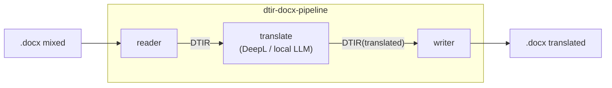

[日本語](./README.md) | **English**

# @shuji-bonji/dtir-docx-pipeline

The **end-to-end harness** for mixed-language docx translation. It ties together
`dtir-ooxml-reader-mcp` → `dtir-translate-mcp` → `dtir-ooxml-writer-mcp` — the **one and only place that "depends on everything."**



## Why a separate repo

Each MCP (reader / writer / translate) is kept loosely coupled so it can be tested standalone, **depending only on the
contract (`doc-translation-ir`)**. The integration that spans all three (the real reader→translate→writer) is concentrated
in this repo, so the individual repos never take on a sibling dependency. It is also the home for future
**LangGraph orchestration** (fixed DAG + xCOMET re-translation loop).

## Usage (library)

```ts
import { translateDocx } from '@shuji-bonji/dtir-docx-pipeline';
import { DeeplHttpTranslator } from '@shuji-bonji/dtir-translate-mcp/translate';

const { docx, dtir, stats } = await translateDocx(
  readFileSync('mixed.docx'),
  new DeeplHttpTranslator(process.env.DEEPL_API_KEY!),
  { targetLang: 'en-GB' },
);
```

Swap the `Translator` and it becomes local-LLM translation.

## Tests

```sh
# Build the dependency packages first (the pipeline consumes their dist)
( cd ../dtir-ooxml-reader-mcp && npm run build )
( cd ../dtir-ooxml-writer-mcp && npm run build )
( cd ../dtir-translate-mcp   && npm run build )

npm install
npm run test:e2e   # produce a real translated docx using a real DeepL translation map
```

`test/fixtures/real-deepl-map.json` holds translations obtained from the real DeepL MCP. Fed in via
`StaticMapTranslator`, it confirms `translated=6 / batchCalls=4` (the number of language groups).

## Dependencies (polyrepo)

The four packages are referenced via `file:../`. After publishing, switch to the npm versions / `github:` dependencies.

## Demo & usage guides

- Demo inputs and verification commands: [`demo/README.en.md`](./demo/README.en.md)
- Claude Desktop / Claude Code (cloud) usage: [`docs/cloud-llm-usage.en.md`](./docs/cloud-llm-usage.en.md)
- Local LLM (Ollama) headless usage: [`docs/local-llm-usage.en.md`](./docs/local-llm-usage.en.md)
