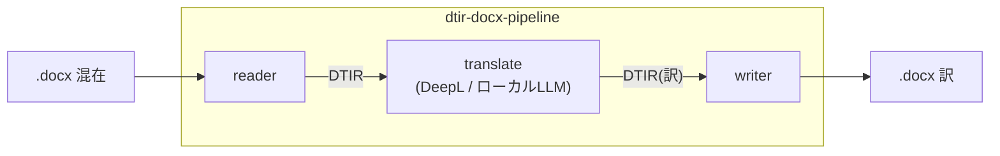

# @shuji-bonji/dtir-docx-pipeline

混在言語 docx 翻訳の **end-to-end ハーネス**。`dtir-ooxml-reader-mcp` →
`dtir-translate-mcp` → `dtir-ooxml-writer-mcp` を束ねる、**唯一「全部に依存する」場所**。



## なぜ別リポジトリか

各 MCP（reader / writer / translate）は **contract(`doc-translation-ir`) だけに依存**して
単独でテストできるよう疎結合に保つ。3つを跨ぐ統合（本物の reader→translate→writer）は
この repo に集約することで、個別 repo に sibling 依存を持ち込まない。
将来の **LangGraph オーケストレーション**（固定 DAG ＋ xCOMET 再翻訳ループ）の定位地でもある。

## 使い方（ライブラリ）

```ts
import { translateDocx } from '@shuji-bonji/dtir-docx-pipeline';
import { DeeplHttpTranslator } from '@shuji-bonji/dtir-translate-mcp/translate';

const { docx, dtir, stats } = await translateDocx(
  readFileSync('mixed.docx'),
  new DeeplHttpTranslator(process.env.DEEPL_API_KEY!),
  { targetLang: 'en-GB' },
);
```

`Translator` を差し替えればローカル LLM 翻訳にもなる。

## テスト

```sh
# 依存パッケージを先にビルド（pipeline は dist を消費する）
( cd ../dtir-ooxml-reader-mcp && npm run build )
( cd ../dtir-ooxml-writer-mcp && npm run build )
( cd ../dtir-translate-mcp   && npm run build )

npm install
npm run test:e2e   # 実 DeepL 訳マップで本物の訳 docx を生成
```

`test/fixtures/real-deepl-map.json` は実 DeepL MCP で取得した訳。`StaticMapTranslator` で
流し込み、`translated=6 / batchCalls=4`（言語グループ数）を確認する。

## 依存（polyrepo）

`file:../` で4パッケージを参照。公開後は npm 版 / `github:` 依存に差し替える。
