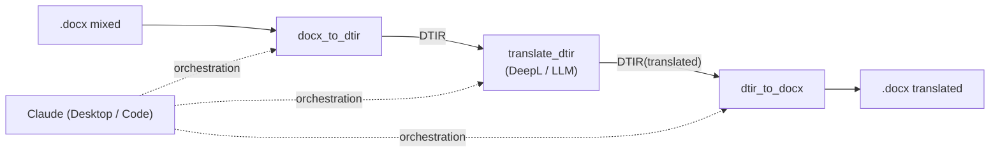
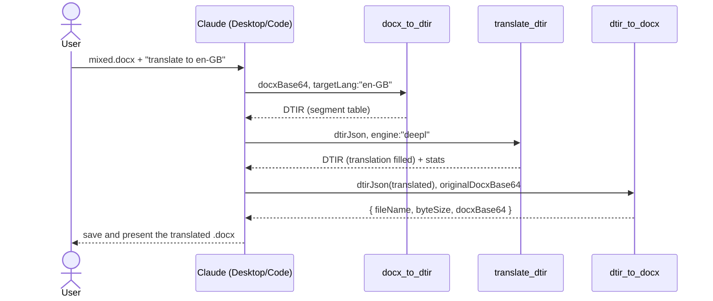

[日本語](./cloud-llm-usage.md) | **English**

# Cloud LLM usage guide — DTIR docx translation pipeline

> After reading this, you will be able to **call the DTIR MCP servers from Claude Desktop / Claude Code and translate
> a mixed-language `.docx` without breaking formatting, images, or the table of contents**.
> For headless use with a local LLM (Ollama), see [`local-llm-usage.en.md`](./local-llm-usage.en.md)
> (this document only shows the engine-switching seam).

## Target repositories

| Repository                                                                    | Role                                                       | MCP tool         |
| ----------------------------------------------------------------------------- | ---------------------------------------------------------- | ---------------- |
| [doc-translation-ir](https://github.com/shuji-bonji/doc-translation-ir)       | Shared contract (DTIR v0.1). Types/schema only, not a server | —              |
| [dtir-ooxml-reader-mcp](https://github.com/shuji-bonji/dtir-ooxml-reader-mcp) | docx → DTIR segment table                                  | `docx_to_dtir`   |
| [dtir-translate-mcp](https://github.com/shuji-bonji/dtir-translate-mcp)       | Fills DTIR's `translation` (DeepL / LLM)                   | `translate_dtir` |
| [dtir-ooxml-writer-mcp](https://github.com/shuji-bonji/dtir-ooxml-writer-mcp) | Translated DTIR + original docx → translated docx          | `dtir_to_docx`   |
| [dtir-docx-pipeline](https://github.com/shuji-bonji/dtir-docx-pipeline)       | E2E harness (library/test use; not needed for MCP wiring)  | —                |



The cloud LLM (Claude) is the **orchestrator**. It calls the three tools in order, relaying the DTIR JSON and base64.

## 1. Prerequisites & build

Node.js 20+. Because of the polyrepo layout, place `doc-translation-ir` next to the others **at build time only**
(type-only dependency; not needed at runtime).

```sh
git clone https://github.com/shuji-bonji/doc-translation-ir.git
git clone https://github.com/shuji-bonji/dtir-ooxml-reader-mcp.git
git clone https://github.com/shuji-bonji/dtir-ooxml-writer-mcp.git
git clone https://github.com/shuji-bonji/dtir-translate-mcp.git

# npm install in each repo (`prepare` auto-builds → dist/index.js)
for d in dtir-ooxml-reader-mcp dtir-ooxml-writer-mcp dtir-translate-mcp; do
  (cd $d && npm install)
done
```

Rebuild with `npm run build` in each repo.

## 2. Connecting to Claude Desktop

Register the three servers in `claude_desktop_config.json` (`/ABS/PATH` is the absolute path of your clone):

```jsonc
{
  "mcpServers": {
    "dtir-ooxml-reader": {
      "command": "node",
      "args": ["/ABS/PATH/dtir-ooxml-reader-mcp/dist/index.js"],
    },
    "dtir-translate": {
      "command": "node",
      "args": ["/ABS/PATH/dtir-translate-mcp/dist/index.js"],
      "env": { "DEEPL_API_KEY": "your-deepl-key" },
      // For a cloud LLM engine:
      // "env": { "LLM_MODEL": "gpt-4o-mini", "LLM_API_KEY": "sk-..." }
    },
    "dtir-ooxml-writer": {
      "command": "node",
      "args": ["/ABS/PATH/dtir-ooxml-writer-mcp/dist/index.js"],
    },
  },
}
```

Put API keys **only in this config file** (never in the repo).
After registering, restart Claude Desktop; the connection is ready when `docx_to_dtir` / `translate_dtir` / `dtir_to_docx` appear in the tool list.

## 3. Connecting to Claude Code

```sh
claude mcp add dtir-ooxml-reader -- node /ABS/PATH/dtir-ooxml-reader-mcp/dist/index.js
claude mcp add dtir-ooxml-writer -- node /ABS/PATH/dtir-ooxml-writer-mcp/dist/index.js

# Pass env to translate according to the engine
# DeepL:
claude mcp add -e DEEPL_API_KEY=your-key dtir-translate -- node /ABS/PATH/dtir-translate-mcp/dist/index.js
# Cloud LLM (OpenAI-compatible):
claude mcp add -e LLM_MODEL=gpt-4o-mini -e LLM_API_KEY=sk-... dtir-translate -- node /ABS/PATH/dtir-translate-mcp/dist/index.js
```

## 4. Switching the translation engine

`translate_dtir`'s engine is set by the tool argument `engine`, or auto-selected from env if omitted
(`llm` if `LLM_MODEL` is set, else `deepl`).

| engine          | Required env                | Notes                                                                                                                |
| --------------- | --------------------------- | -------------------------------------------------------------------------------------------------------------------- |
| `deepl`         | `DEEPL_API_KEY`             | One request per group via the HTTP API's `text[]` array. Free/Pro is auto-detected by the `:fx` key suffix (or set explicitly via `apiUrl`/`DEEPL_API_URL`) |
| `llm` (cloud)   | `LLM_MODEL`, `LLM_API_KEY`  | OpenAI-compatible. Default baseUrl is `https://api.openai.com/v1`                                                     |
| `llm` (local)   | `LLM_MODEL`, `LLM_BASE_URL` | e.g. `LLM_BASE_URL=http://localhost:11434/v1` (Ollama). See [`local-llm-usage.en.md`](./local-llm-usage.en.md)       |

### 4.1 Glossary — term consistency

In legal/technical documents, inconsistent term translations hurt quality (xCOMET is a score and does not guarantee
term consistency). Make **inline term pairs the single source of truth** and pass them via `translate_dtir`'s
`glossaryJson` (CLI: `GLOSSARY_PATH`); the same glossary is bridged to both engines:

- **LLM**: per source language, the relevant term pairs are force-injected into the prompt (no external state, deterministic)
- **DeepL**: the `glossary_id` from `deeplIds` is applied per source language (DeepL's native mechanism)

To handle mixed languages, look up **per source language** (`bySource`). `'*'` is source-independent (LLM only).

```jsonc
{
  "target": "en-GB",
  "bySource": {
    "de-DE": [{ "source": "Vertrag", "target": "Agreement" }],
    "fr-FR": [{ "source": "résiliation", "target": "termination" }],
    "*":     [{ "source": "GDPR", "target": "GDPR" }]
  },
  // DeepL only. Put the pre-created id per source language
  "deeplIds": { "de-DE": "xxxxxxxx-xxxx-...", "fr-FR": "yyyyyyyy-..." }
}
```

A DeepL `glossary_id` must be created in advance. You can create one from inline term pairs with
`DeeplHttpTranslator.createDeeplGlossary(apiKey, {name, sourceLang, targetLang, entries})` and get the id
(or create it via DeepL's glossary tools/console). If you only use an LLM, `deeplIds` is unnecessary and the
`bySource` term pairs alone take effect.

## 5. Usage flow (how to use it in conversation)

### 5.1 Basic sequence



### 5.2 Prompt example

In an environment with file access (Claude Code / Cowork), one message is enough:

```
Translate mixed.docx to en-GB with the DTIR pipeline and save it as mixed.en-GB.docx.
Steps: docx_to_dtir → translate_dtir (engine: deepl) → dtir_to_docx.
The originalDocxBase64 you pass to the writer must be identical to the original file.
```

Claude autonomously calls the three tools in order. The `stats` returned by `translate_dtir`
(`translated` / `batchCalls`) confirm convergence to "a batch per language"
(e.g. 6 segments, 4 languages → `batchCalls=4`).

### 5.3 Passing docxBase64

All three tools exchange base64 / JSON strings. How to base64-encode the original docx differs per environment:

| Environment                      | Method                                                                                                            |
| -------------------------------- | ---------------------------------------------------------------------------------------------------------------- |
| Claude Code / Cowork             | Files can be read directly, so Claude base64-encodes them via shell etc. and passes them (recommended)           |
| Claude Desktop (chat only)       | Use a filesystem MCP to read the file. Note: an attached docx gets text-extracted and cannot be passed as binary to the MCP |

### 5.4 The variant where Claude translates itself

Instead of using `translate_dtir`, **Claude can fill DTIR's `translation` directly** and pass it to the writer
(only the reader / writer MCPs are needed; no API key).

- Good for: few segments, context-dependent translation tuning, trying it out with no engine configured
- Not good for: many segments (context consumption, count-mismatch risk).
  The conditions are: don't break the `id`↔`translation` correspondence, and don't touch `translatable:false`.

For steady-state use, prefer `translate_dtir` (batch aggregation, boundary preservation, and array-length validation are built in).

## 6. Tool reference

### `docx_to_dtir` (dtir-ooxml-reader)

| Argument     | Required | Meaning                                          |
| ------------ | -------- | ------------------------------------------------ |
| `docxBase64` | ✅       | base64-encoded .docx                             |
| `fileName`   | –        | original file name (metadata)                    |
| `targetLang` | –        | target BCP47 (stored in DTIR `language.target`)  |

Returns: the DTIR (`IRDocument`) JSON.

### `translate_dtir` (dtir-translate)

| Argument     | Required | Meaning                                                   |
| ------------ | -------- | --------------------------------------------------------- |
| `dtirJson`   | ✅       | the reader's DTIR JSON string                             |
| `targetLang` | –        | target BCP47 (default: `dtir.language.target`)            |
| `engine`     | –        | `deepl` \| `llm` (default: llm if `LLM_MODEL` is set)     |
| `apiUrl`     | –        | DeepL API base URL (if omitted, Free/Pro auto-detected by the `:fx` key suffix) |
| `glossaryJson` | –      | glossary JSON (§4.1). Enforces term consistency          |
| `maxItems`   | –        | max segments per batch (default deepl=50 / llm=20)        |
| `maxChars`   | –        | max total characters per batch (default deepl=120000 / llm=4000) |
| `inlineFormatting` | –  | `collapse` (default) / `runs` (preserve intra-paragraph bold/color/links; §7) |

Returns: `{ engine, stats: { translated, batchCalls, chunked, evaluated }, dtir }`
(`chunked` is the number of times a language group was further split by the size limits).

### `dtir_to_docx` (dtir-ooxml-writer)

| Argument               | Required | Meaning                                              |
| ---------------------- | -------- | ---------------------------------------------------- |
| `dtirJson`             | ✅       | the translated DTIR JSON string                      |
| `originalDocxBase64`   | ✅       | base64 of the **original .docx** (identical to what was passed to the reader) |
| `onMissingTranslation` | –        | `keep` (default; keep source) \| `error`             |

Returns: `{ fileName, byteSize, docxBase64 }`.

## 7. Notes & limitations

- **Recursive walking (v0.2 reader/writer)**: tables (`w:tbl` / merged cells), footnotes/endnotes (`footnotes.xml` /
  `endnotes.xml`), hyperlink text, and tracked changes (`w:ins`) are **included in extraction/translation**.
  This covers in one go the structures that used to be missed when only walking body-direct paragraphs and paragraph-direct runs
  (regression tests: reader `npm run test:torture` = 7/7, writer `npm run test:torture`).
  Deleted text (`w:del`) is excluded.
- **Size batching**: language groups are chunked by `maxItems` / `maxChars`, preventing a long single-language document
  from becoming "one giant batch → DeepL request limit / LLM context limit exceeded"
  (segment boundaries are never split; defaults deepl=50 items/120000 chars, llm=20 items/4000 chars; check `stats.chunked` for the split count).
- **Context consumption**: the DTIR JSON and base64 flow through the conversation, so a large docx consumes tokens.
  For tens of pages, going through the library (`dtir-docx-pipeline`'s `translateDocx()`) is realistic.
- **Intra-paragraph formatting (collapse / runs)**: the default `collapse` discards intra-paragraph formatting
  (bold/color/link display color/underline) and unifies it to the first run's format. With `inlineFormatting:'runs'`,
  a multi-run paragraph is translated with `<x id>` inline tags (DeepL `tag_handling=xml` / a tag-preservation instruction to the LLM),
  the translation is restored per run, and each run's format is preserved when distributing (`translation.runTexts`).
  A paragraph that fails to restore automatically falls back to collapse (fail-safe). **The correctness of the paragraph text is always preserved, and the structure never breaks.**
  - **Limitation under heavy reordering (verified)**: DeepL's `tag_handling` preserves "tag count and relative order" but
    **does not follow semantically**. e.g. the German bold "gestern" in "Der Vertrag wurde **gestern** unterzeichnet."
    → "The contract was **signed** yesterday." (runTexts=`["The contract was ","signed"," yesterday."]`).
    The intended "yesterday" moved to the end, but the tags are distributed positionally, so **the bold lands on "signed"**.
    It is not corruption (the sentence is correct, exactly one word is bold, the structure is sound), but **for pairs with large word-order changes the emphasis may move to a different word**.
    For same-family pairs / small reorderings, the practical impact is small.
  - **Engine suitability (compared on real hardware)**: runs mode is **suited to DeepL** (it reliably preserves `<x>` tags).
    On the other hand, **translation-specialized local models (e.g. tower-plus:9b) tend to drop the tags**, in which case restoration fails →
    automatic collapse (no formatting, but the sentence is correct and the structure sound). In the same German example, DeepL preserved the bold (with the word shift),
    while tower-plus fell back to collapse. **To preserve formatting, use DeepL (a-2/a-3)**; to attempt it locally (b-2/b-3),
    try a **general chat model** that follows tag instructions, or `LLM_JSON_MODE=false`.
- **Intra-paragraph language switching is not captured**: `language` is per segment.
- **Untouchability guarantee**: complex fields such as TOC, numerics-only, `sectPr`, and images never enter the IR, so they cannot break by construction.
- For quality verification, feed `@shuji-bonji/xcomet-mcp`'s `xcomet_batch_evaluate` with
  `{source: text.source, translation: translation.text}` (no lang needed).

## 8. Troubleshooting

### `translate_dtir failed: fetch failed` with Claude Desktop × local LLM (b-2)

A classic pattern when going out to a local LLM (e.g. Ollama on a host) with `engine: "llm"`: **the Terminal `curl` works, but only the MCP's fetch fails**.

**Root cause**: macOS's "Local Network" privacy permission applies **per connecting executable binary**. The MCP server's LAN
connection (to Ollama) is made not by Claude.app but by the **`node` process Claude spawns**, so **even if Claude.app is allowed, if `node`
is not, the connection is blocked**. Furthermore, when nvm etc. provides multiple node versions, **the version Claude actually uses** must be allowed
(check the version in Claude Desktop's MCP log `~/Library/Logs/Claude/mcp-server-<name>.log`, line `Using MCP server command: .../vX.Y.Z/bin/node ...`).

**Decisive test** (run with the absolute path of the node Claude uses; if OK, node itself can reach it, so it's a permission issue):

```sh
/Users/<you>/.nvm/versions/node/vX.Y.Z/bin/node \
  -e 'fetch("http://<ollama IP>:11434/api/tags").then(_=>console.log("OK")).catch(e=>console.log("FAIL",e.cause||e))'
```

**Fix**:

1. System Settings → Privacy & Security → **Local Network**, turn **ON the `node` (that version) Claude uses**
2. **Fully quit Claude Desktop with ⌘Q and restart** (respawn the MCP server with permission)

Note: the symptom is the same with a `.local` (mDNS) name or an IP (it's not an address problem). To isolate it, check "does the Terminal `curl` work?" and "does `node -e fetch` with the node Claude uses work?". If it's due to a cold load, the symptom appears as `Request timed out` rather than `fetch failed`, so pre-warming with `ollama run <model> ""` avoids confusion.

## 9. Uninstall

- Claude Desktop: remove the 3 entries from `claude_desktop_config.json` and restart
- Claude Code: `claude mcp remove dtir-ooxml-reader` and the other 2 servers individually
- Repositories: delete the 4–5 cloned directories

## See also

- DTIR contract design details: `doc-translation-ir/README.en.md`
- Real E2E verification results (real DeepL, xCOMET average 0.993): `dtir-translate-mcp/README.en.md` / this repo's `demo/`
- Headless use with a local LLM (Ollama) engine: [`local-llm-usage.en.md`](./local-llm-usage.en.md)
