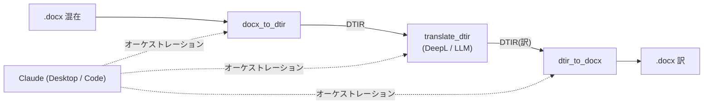
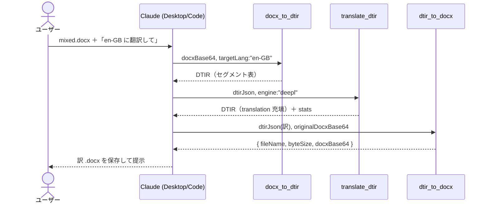

# クラウド LLM での利用マニュアル — DTIR docx 翻訳パイプライン

> この文書を読むと、**Claude Desktop / Claude Code から DTIR MCP 群を呼び出し、
> 混在言語 `.docx` を書式・画像・目次を崩さずに翻訳できる**ようになる。
> ローカル LLM（Ollama）でのヘッドレス利用は [`local-llm-usage.md`](./local-llm-usage.md) を参照
> （本文書はエンジン切替の接続点のみ示す）。

## 対象リポジトリ

| リポジトリ                                                                    | 役割                                                       | MCP ツール       |
| ----------------------------------------------------------------------------- | ---------------------------------------------------------- | ---------------- |
| [doc-translation-ir](https://github.com/shuji-bonji/doc-translation-ir)       | 共有契約 (DTIR v0.1)。型・スキーマのみ、サーバではない     | —                |
| [dtir-ooxml-reader-mcp](https://github.com/shuji-bonji/dtir-ooxml-reader-mcp) | docx → DTIR セグメント表                                   | `docx_to_dtir`   |
| [dtir-translate-mcp](https://github.com/shuji-bonji/dtir-translate-mcp)       | DTIR の `translation` を充填（DeepL / LLM）                | `translate_dtir` |
| [dtir-ooxml-writer-mcp](https://github.com/shuji-bonji/dtir-ooxml-writer-mcp) | 翻訳済み DTIR ＋ 元 docx → 訳 docx                         | `dtir_to_docx`   |
| [dtir-docx-pipeline](https://github.com/shuji-bonji/dtir-docx-pipeline)       | E2E ハーネス（ライブラリ利用・テスト用。MCP 接続では不要） | —                |



クラウド LLM（Claude）は **オーケストレーター**。3 ツールを順に呼び、DTIR JSON と base64 を中継する。

## 1. 前提・ビルド

Node.js 20+。polyrepo 構成のため **build 時だけ** `doc-translation-ir` を隣に置く
（型のみ依存。実行時は不要）。

```sh
git clone https://github.com/shuji-bonji/doc-translation-ir.git
git clone https://github.com/shuji-bonji/dtir-ooxml-reader-mcp.git
git clone https://github.com/shuji-bonji/dtir-ooxml-writer-mcp.git
git clone https://github.com/shuji-bonji/dtir-translate-mcp.git

# 各リポジトリで npm install（prepare で自動ビルド → dist/index.js）
for d in dtir-ooxml-reader-mcp dtir-ooxml-writer-mcp dtir-translate-mcp; do
  (cd $d && npm install)
done
```

再ビルドは各リポジトリで `npm run build`。

## 2. Claude Desktop への接続

`claude_desktop_config.json` に 3 サーバを登録（`/ABS/PATH` は clone 先の絶対パス）:

```jsonc
{
  "mcpServers": {
    "dtir-ooxml-reader": {
      "command": "node",
      "args": ["/ABS/PATH/dtir-ooxml-reader-mcp/dist/index.js"],
    },
    "dtir-translate": {
      "command": "node",
      "args": ["/ABS/PATH/dtir-translate-mcp/dist/index.js"],
      "env": { "DEEPL_API_KEY": "your-deepl-key" },
      // クラウドLLMエンジンの場合:
      // "env": { "LLM_MODEL": "gpt-4o-mini", "LLM_API_KEY": "sk-..." }
    },
    "dtir-ooxml-writer": {
      "command": "node",
      "args": ["/ABS/PATH/dtir-ooxml-writer-mcp/dist/index.js"],
    },
  },
}
```

API キーは **この設定ファイルにのみ** 置く（リポジトリに入れない）。
登録後 Claude Desktop を再起動し、ツール一覧に `docx_to_dtir` / `translate_dtir` / `dtir_to_docx` が出れば接続完了。

## 3. Claude Code への接続

```sh
claude mcp add dtir-ooxml-reader -- node /ABS/PATH/dtir-ooxml-reader-mcp/dist/index.js
claude mcp add dtir-ooxml-writer -- node /ABS/PATH/dtir-ooxml-writer-mcp/dist/index.js

# translate はエンジンに応じて env を渡す
# DeepL:
claude mcp add -e DEEPL_API_KEY=your-key dtir-translate -- node /ABS/PATH/dtir-translate-mcp/dist/index.js
# クラウドLLM (OpenAI互換):
claude mcp add -e LLM_MODEL=gpt-4o-mini -e LLM_API_KEY=sk-... dtir-translate -- node /ABS/PATH/dtir-translate-mcp/dist/index.js
```

## 4. 翻訳エンジンの切替

`translate_dtir` のエンジンは tool 引数 `engine`、省略時は env で自動選択
（`LLM_MODEL` があれば `llm`、なければ `deepl`）。

| engine            | 必要 env                    | 備考                                                                                                                                            |
| ----------------- | --------------------------- | ----------------------------------------------------------------------------------------------------------------------------------------------- |
| `deepl`           | `DEEPL_API_KEY`             | HTTP API の `text[]` 配列で group 単位 1 リクエスト。Free/Pro はキー末尾 `:fx` で自動判定（`apiUrl`/`DEEPL_API_URL` で明示も可）                                                  |
| `llm`（クラウド） | `LLM_MODEL`, `LLM_API_KEY`  | OpenAI 互換。既定 baseUrl は `https://api.openai.com/v1`                                                                                        |
| `llm`（ローカル） | `LLM_MODEL`, `LLM_BASE_URL` | 例: `LLM_BASE_URL=http://localhost:11434/v1`（Ollama）。詳細は [`local-llm-usage.md`](./local-llm-usage.md) |

## 5. 利用フロー（会話での使い方）

### 5.1 基本シーケンス



### 5.2 プロンプト例

ファイルアクセスがある環境（Claude Code / Cowork）なら 1 メッセージで完結する:

```
mixed.docx を DTIR パイプラインで en-GB に翻訳して、
mixed.en-GB.docx として保存して。
手順: docx_to_dtir → translate_dtir (engine: deepl) → dtir_to_docx。
writer に渡す originalDocxBase64 は元ファイルと同一のものを使うこと。
```

Claude は自律的に 3 ツールを順に呼ぶ。`translate_dtir` の戻りの `stats`
（`translated` / `batchCalls`）で「言語数ぶんのバッチに収束」していることが確認できる
（例: 6 セグメント・4 言語 → `batchCalls=4`）。

### 5.3 docxBase64 の受け渡し

3 ツールはすべて base64 / JSON 文字列でやり取りする。元 docx を base64 化する手段が環境ごとに異なる:

| 環境                           | 方法                                                                                                                       |
| ------------------------------ | -------------------------------------------------------------------------------------------------------------------------- |
| Claude Code / Cowork           | ファイルを直接読めるため、Claude がシェル等で base64 化して渡す（推奨）                                                    |
| Claude Desktop（チャットのみ） | filesystem 系 MCP を併用してファイルを読ませる。docx 添付はテキスト抽出されてしまい、バイナリとして MCP に渡せない点に注意 |

### 5.4 Claude 自身が翻訳する変則パターン

`translate_dtir` を使わず、**Claude が DTIR の `translation` を直接埋めて** writer に渡すこともできる
（reader / writer の 2 MCP だけで完結。API キー不要）。

- 向く: セグメント数が少ない、文脈依存の訳調整をしたい、エンジン未設定で試したい
- 向かない: セグメント数が多い場合（コンテキスト消費・件数ズレのリスク）。
  `id` と `translation` の対応を崩さないこと、`translatable:false` に触らないことが条件

定常運用は `translate_dtir`（バッチ集約・境界保持・配列長検証が組み込み）を推奨。

## 6. ツールリファレンス

### `docx_to_dtir` (dtir-ooxml-reader)

| 引数         | 必須 | 意味                                          |
| ------------ | ---- | --------------------------------------------- |
| `docxBase64` | ✅   | base64 エンコードした .docx                   |
| `fileName`   | –    | 元ファイル名（メタ情報）                      |
| `targetLang` | –    | 翻訳先 BCP47（DTIR `language.target` に格納） |

戻り: DTIR (`IRDocument`) の JSON。

### `translate_dtir` (dtir-translate)

| 引数         | 必須 | 意味                                                      |
| ------------ | ---- | --------------------------------------------------------- |
| `dtirJson`   | ✅   | reader 出力の DTIR JSON 文字列                            |
| `targetLang` | –    | 翻訳先 BCP47（既定: `dtir.language.target`）              |
| `engine`     | –    | `deepl` \| `llm`（既定: `LLM_MODEL` があれば llm）        |
| `apiUrl`     | –    | DeepL API ベース URL（省略時はキー末尾 `:fx` で Free/Pro 自動判定） |

戻り: `{ engine, stats: { translated, batchCalls, evaluated }, dtir }`。

### `dtir_to_docx` (dtir-ooxml-writer)

| 引数                   | 必須 | 意味                                                |
| ---------------------- | ---- | --------------------------------------------------- |
| `dtirJson`             | ✅   | 翻訳済み DTIR の JSON 文字列                        |
| `originalDocxBase64`   | ✅   | **元 .docx** の base64（reader に渡したものと同一） |
| `onMissingTranslation` | –    | `keep`（既定・原文維持）\| `error`                  |

戻り: `{ fileName, byteSize, docxBase64 }`。

## 7. 注意・制限（v0.1）

- **コンテキスト消費**: DTIR JSON と base64 が会話を流れるため、大きい docx ではトークンを食う。
  数十ページ規模はライブラリ経由（`dtir-docx-pipeline` の `translateDocx()`）が現実的。
- **collapse 既定**: 段内書式（太字・色の途中切替）は失われ、先頭ランの書式に統一される。
  保持は `text.runs` を使う tag-aware writer（v0.2）待ち。
- **段落内の言語切替は拾えない**: `language` はセグメント単位。
- **不可触の保証**: TOC 等の複合フィールド・数値のみ・`sectPr`・画像は IR に乗らないため原理的に崩れない。
- 品質検証は `@shuji-bonji/xcomet-mcp` の `xcomet_batch_evaluate` に
  `{source: text.source, translation: translation.text}` を流せばよい（lang 指定不要）。

## 8. アンインストール

- Claude Desktop: `claude_desktop_config.json` から 3 エントリを削除して再起動
- Claude Code: `claude mcp remove dtir-ooxml-reader` ほか 3 サーバを各々 remove
- リポジトリ: clone した 4〜5 ディレクトリを削除

## 関連

- DTIR 契約の設計詳細: `doc-translation-ir/README.md`
- 実機 E2E の検証結果（実 DeepL・xCOMET 平均 0.993）: `dtir-translate-mcp/README.md` / 本リポジトリ `demo/`
- ローカル LLM（Ollama）エンジンでのヘッドレス利用・実装手順: [`local-llm-usage.md`](./local-llm-usage.md)
