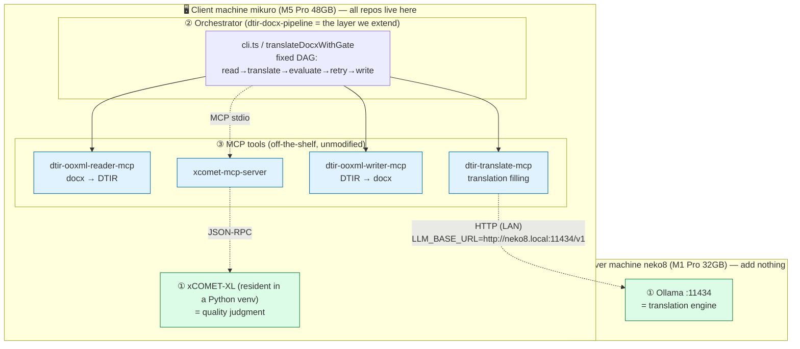
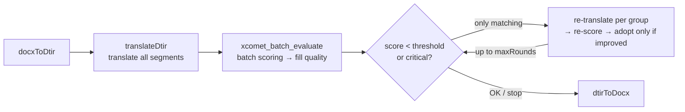

[日本語](./local-llm-usage.md) | **English**

# Local LLM usage guide — mixed-language docx translation pipeline (dtir MCP group)

> **What you'll be able to do in this chapter**: use neko8's Ollama as the translation engine to headlessly translate
> mixed-language docx **without sending anything to the cloud**, using the home-grown dtir MCP group, all the way through
> the xCOMET quality gate and model comparison.
>
> **Positioning**: a guide for the "consuming" side of the neko8 built in `llm-server-setup.md`. Not server construction —
> a concrete example of **embedding a local LLM as a part (the translation engine) into a home-grown MCP group**.
>
> **Prerequisites**:
>
> - `llm-server-setup.md` complete (Ollama on neko8 is reachable from the LAN)
> - Node.js 20+ / npm / git on the client machine (e.g. mikuro)
> - (Phase 2 only) a Python 3.9–3.12 venv + a HuggingFace account (XCOMET-XL is gated)

## Big picture — fix the three layers first



> In the headless CLI, reader / translate / writer are called **as library APIs in the same process, not as MCP servers**
> (this is where it differs from the conversational drive of [`cloud-llm-usage.en.md`](./cloud-llm-usage.en.md)). The only two
> things that cross a process boundary are **xcomet-mcp-server (stdio)** and **Ollama (HTTP over LAN)**.

**The most important asymmetry** (get this wrong and you mis-design):

- **Ollama = the translation engine.** Called over HTTP **inside** `dtir-translate-mcp`. Not an MCP. Just point `LLM_BASE_URL` at it.
- **xCOMET = quality judgment.** An independent MCP server **called as a tool by the orchestrator**. The re-translation loop is also on the orchestrator side.
- Let the local LLM do only "translation"; **which tools to call in what order is fixed by deterministic code** (don't make the LLM infer the order).

### Role split (per machine)

| Machine              | Role                       | What it needs                        |
| -------------------- | -------------------------- | ------------------------------------ |
| neko8 (M1 Pro 32GB)  | Dedicated translation engine | Ollama + translation models (5–6GB each) |
| mikuro (M5 Pro 48GB) | Orchestrator + quality judge | dtir repos, xCOMET-XL (~14GB RAM)  |

The repos only need to be placed **on the side where the orchestrator runs**. Add nothing to neko8.

### Execution sequence

```mermaid
sequenceDiagram
  actor U as User (CLI)
  box Client machine mikuro — same process (library calls)
    participant P as cli.ts／pipeline
    participant R as reader (lib)
    participant T as translate (lib)
    participant W as writer (lib)
  end
  box Client machine mikuro — separate process
    participant XM as xcomet-mcp-server
  end
  box Server machine neko8
    participant O as Ollama :11434
  end

  U->>P: input.docx, TARGET_LANG=ja
  P->>R: docxToDtir(buf)
  R-->>P: DTIR (segment table, language resolved)
  P->>T: translateDtir(dtir, LlmTranslator)
  loop per language group (batchCalls times)
    T->>O: POST /v1/chat/completions (JSON mode)
    O-->>T: {"translations":[...]} (validate array length; corrective retry on mismatch)
  end
  T-->>P: DTIR (translation filled) + stats
  opt XCOMET_GATE=1
    P->>XM: xcomet_batch_evaluate(pairs)
    XM-->>P: per-segment score / critical (quality filled)
    loop only below threshold, up to maxRounds
      P->>T: translateBatch(failing segments, per group)
      T->>O: re-translate
      O-->>T: candidate translation
      P->>XM: re-score
      Note over P: adopt only if improved (keep old on regression)
    end
  end
  P->>W: dtirToDocx(dtir, original docx)
  W-->>P: translated docx (patch by id, structure preserved)
  P-->>U: output.ja.docx + gate log
```

## 1. Repository layout (client machine)

Because the polyrepo's `file:` dependencies are relative, **place the 6 repos as siblings under the same parent directory**.

```sh
mkdir -p ~/workspace/shuji-bonji/mcps && cd ~/workspace/shuji-bonji/mcps
for r in doc-translation-ir dtir-ooxml-reader-mcp dtir-ooxml-writer-mcp \
         dtir-translate-mcp dtir-docx-pipeline xcomet-mcp-server; do
  git clone https://github.com/shuji-bonji/$r.git
done

# install in dependency order (the `prepare` script auto-builds dist/)
( cd doc-translation-ir    && npm install )
( cd dtir-ooxml-reader-mcp && npm install )
( cd dtir-ooxml-writer-mcp && npm install )
( cd dtir-translate-mcp    && npm install )
( cd dtir-docx-pipeline    && npm install )
( cd xcomet-mcp-server     && npm install )   # used in Phase 2
```

> Without `dist/`, you get "Server disconnected" or module-resolution failures. Rebuild with `npm run build`.

The following are implemented in `dtir-docx-pipeline` (2026-06-11; the other repos are unmodified):

| File                                           | Role                                                            |
| ---------------------------------------------- | --------------------------------------------------------------- |
| `src/cli.ts`                                   | headless translation CLI (shared by Phase 1/2)                  |
| `src/verify.ts`                                | acceptance verification (`validateDtir`, structure comparison)  |
| `src/xcomet-evaluator.ts`                      | `XcometMcpEvaluator` (stdio client for xcomet-mcp-server)       |
| `translateDocxWithGate()` in `src/pipeline.ts` | quality gate + partial re-translation loop                      |
| `test/model-bench.ts`                          | model comparison harness                                        |

## 2. Preparing translation models (on neko8)

Choose non-Chinese, Japanese-capable models that fit q4 quantization on an M1 Pro 32GB (8–9B → 5–6GB).

```sh
# Start with this (Ollama official, light, follows instructions well)
ollama pull aya-expanse:8b
```

### Tower+ 9B (translation-specialized, the main pick)

Not in Ollama's official library, but you can **pull the GGUF from HF directly**, so no hand-written Modelfile is needed.

```sh
ollama pull hf.co/mradermacher/Tower-Plus-9B-GGUF:Q4_K_M   # 5.8GB
ollama cp hf.co/mradermacher/Tower-Plus-9B-GGUF:Q4_K_M tower-plus:9b   # give it an alias

# Smoke test (OpenAI-compatible endpoint)
curl http://localhost:11434/v1/chat/completions -d '{
  "model": "tower-plus:9b",
  "messages": [{"role":"user","content":"Translate to Japanese: The quarterly report is attached."}]
}'
# → "四半期報告書が添付されています。"
```

| Model            | Origin        | Characteristics             | Caveat                        |
| ---------------- | ------------- | --------------------------- | ----------------------------- |
| `aya-expanse:8b` | Cohere (CA)   | Strong multilingual, official, light | —                    |
| `tower-plus:9b`  | Unbabel (EU)  | **Translation-specialized.** Same maker as xCOMET | **CC-BY-NC-SA-4.0 (non-commercial)** |
| `gemma4:latest`  | Google (US)   | General-purpose. Solid JSON | for fallback                  |

> Quantization is embedded in the GGUF along with the chat template, so it runs with just a pull. For better translation quality, `Q5_K_M`/`Q6_K` are options. Ollama's `format: json` is llama.cpp grammar enforcement, so it works model-independently.

## 3. Phase 1 — headless translation CLI

```sh
cd ~/workspace/shuji-bonji/mcps/dtir-docx-pipeline

# No args → smoke test with the doc-translation-ir bundled fixture (the nasty NL/FR/DE mixed docx)
LLM_MODEL=tower-plus:9b LLM_BASE_URL=http://neko8.local:11434/v1 \
  npx tsx src/cli.ts

# Any docx to Japanese
LLM_MODEL=tower-plus:9b LLM_BASE_URL=http://neko8.local:11434/v1 TARGET_LANG=ja \
  npx tsx src/cli.ts ./input.docx ./output.ja.docx
```

Measured log (M5 → neko8 / tower-plus:9b):

```
model=tower-plus:9b baseUrl=http://neko8.local:11434/v1 targetLang=ja
in=./demo/mixed-with-ja.en-GB.docx
out=./demo/output.ja.docx translated=7 batchCalls=4 langs=nl-NL,fr-FR,en-GB,en-US time=8.7s
```

`batchCalls=4` is **the number of language groups, not the number of paragraphs**. Because it batches per source language, the number of requests doesn't explode.

### env list (Phase 1)

| env             | Default                     | Meaning                           |
| --------------- | --------------------------- | --------------------------------- |
| `LLM_MODEL`     | `aya-expanse:8b`            | Ollama model name                 |
| `LLM_BASE_URL`  | `http://localhost:11434/v1` | OpenAI-compatible endpoint        |
| `TARGET_LANG`   | `en-GB`                     | target (BCP47)                    |
| `LLM_JSON_MODE` | `true`                      | set `false` for models without JSON mode |

### Acceptance verification

```sh
# 1. Machine check of structure preservation (translated docx → re-reader → validateDtir empty, id set matches original docx)
npx tsx src/verify.ts ./demo/output.ja.docx ./demo/mixed-with-ja.en-GB.docx

# 2. Word compatibility check (LibreOffice)
brew install --cask libreoffice
soffice --headless --convert-to pdf --outdir ./demo ./demo/output.ja.docx
```

> The `Task policy set failed` warning is a harmless LibreOffice QoS warning on macOS; ignore it. Omitting `--outdir` puts the PDF in the current directory.

### Using the DeepL engine (a-3 / cloud translation)

With the same `cli.ts`, passing `DEEPL_API_KEY` **switches the translation engine to DeepL** (instead of the local LLM).
Headless, fixed DAG, and the xCOMET gate stay the same; **only the engine is swapped** (the benefit of the `Translator` abstraction).

```sh
# Free/Pro auto-detected by the ":fx" key suffix (DEEPL_API_URL not needed even for Pro keys)
DEEPL_API_KEY=<your-deepl-key> TARGET_LANG=ja \
  npx tsx src/cli.ts demo/mixed-with-ja.en-GB.docx demo/deepl-out-ja.docx

# The quality gate can be combined too (score DeepL translations with xCOMET)
DEEPL_API_KEY=<key> XCOMET_GATE=1 XCOMET_PYTHON_PATH=~/.xcomet-venv/bin/python3 \
  npx tsx src/cli.ts in.docx out.docx
```

| env | Meaning |
| --- | --- |
| `ENGINE` | `deepl` \| `llm` (default: deepl if `DEEPL_API_KEY` is set, else llm) |
| `DEEPL_API_KEY` | DeepL key. Free(`...:fx`)/Pro auto-detected to pick the endpoint |
| `DEEPL_API_URL` | Optional. Explicit setting wins (usually not needed) |

> Note: if you want to use the local LLM but `DEEPL_API_KEY` is still in the environment, it becomes `engine=deepl`. In that case, set `ENGINE=llm` explicitly.
> In `model-bench` too, you can mix `MODELS="deepl,aya-expanse:8b,tower-plus:9b"` to use **DeepL as the baseline** (how close the local models get to DeepL).

## 4. Phase 2 — xCOMET quality gate + re-translation loop

### 4.1 xCOMET setup (client machine, first time only)

```sh
# venv (Python 3.13+ not allowed)
uv venv ~/.xcomet-venv --python 3.12
source ~/.xcomet-venv/bin/activate
uv pip install "unbabel-comet>=2.2.0"

# XCOMET-XL is gated → after accepting the license on HF
huggingface-cli login
python -c "from comet import download_model; download_model('Unbabel/XCOMET-XL')"   # ~14GB
```

### 4.2 Run

```sh
XCOMET_GATE=1 XCOMET_PYTHON_PATH=~/.xcomet-venv/bin/python3 \
LLM_MODEL=tower-plus:9b LLM_BASE_URL=http://neko8.local:11434/v1 TARGET_LANG=ja \
  npx tsx src/cli.ts ./input.docx ./output.ja.docx
```

Measured log:

```
[gate] round=0 evaluated=7 avg=0.9875 failing=0 critical=0 adopted=0
out=./demo/output.gated.ja.docx translated=7 batchCalls=4 time=48.1s
gate: rounds=1 avg=0.9875 remainingFailing=0
```

### 4.3 How it works (fixed DAG)



Design points:

- Scoring uses **`xcomet_batch_evaluate` in one batch**, not sequential `xcomet_evaluate` (the model is resident; CPU inference takes seconds per pair, so sequential is impractical)
- Re-translation is **adopted only if improved** (if the re-translation scores worse than the old one, keep the old)
- ids that remain low-quality after stopping are logged as `remainingFailing`

You can force the loop to fire by artificially raising the threshold:

```
Example run with XCOMET_THRESHOLD=0.995:
[gate] round=0 evaluated=7 avg=0.9875 failing=2 critical=0 adopted=0
[gate] round=1 avg=0.9875 failing=2 critical=0 adopted=1   ← 1 improvement adopted
[gate] round=2 avg=0.9875 failing=2 critical=0 adopted=0
[gate] stopped: 2 segments still below threshold 0.995
gate: rounds=3 remainingFailing=2 [seg_58a194220a,seg_65a3d4bd42]
```

### env list (Phase 2 additions)

| env                   | Default      | Meaning                         |
| --------------------- | ------------ | ------------------------------- |
| `XCOMET_GATE`         | —            | `1` enables the gate            |
| `XCOMET_PYTHON_PATH`  | auto-detect  | the venv's python               |
| `XCOMET_SERVER_ENTRY` | sibling resolve | xcomet-mcp-server/dist/index.js |
| `XCOMET_THRESHOLD`    | `0.6`        | re-translation threshold        |
| `XCOMET_MAX_ROUNDS`   | `2`          | re-translation round limit      |
| `XCOMET_USE_GPU`      | `false`      | `true` for GPU(MPS) inference   |

> The first load of XCOMET-XL takes a few minutes + ~14GB RAM. The `Health check failed (1/3): Request timeout` right after startup is a load wait that recovers within the retries — harmless.

## 5. Phase 3 — model comparison harness

Translate the same docx with multiple models → score with xCOMET → compare in a Markdown table. xCOMET reuses one process (loads once).

```sh
MODELS="aya-expanse:8b,tower-plus:9b,gemma4:latest" \
LLM_BASE_URL=http://neko8.local:11434/v1 TARGET_LANG=ja \
XCOMET_PYTHON_PATH=~/.xcomet-venv/bin/python3 \
  npx tsx test/model-bench.ts ./input.docx > bench-result.md
```

Measured results (mixed-with-ja.en-GB.docx → ja, 7 segments):

| Model          | Avg score | Min score | critical | Segments | Time   |
| -------------- | --------: | --------: | -------: | -------: | -----: |
| tower-plus:9b  |    98.75% |    92.13% |        0 |        7 |  14.4s |
| gemma4:latest  |    98.62% |    92.13% |        0 |        7 |  16.7s |
| aya-expanse:8b |    98.37% |    92.13% |        0 |        7 |  49.0s |

How to read it:

- The translation-specialized Tower+ leads, but narrowly. **A single 7-segment document has no statistical significance** (for trend-spotting)
- The first model's time includes Ollama-side model loading. For pure speed comparison, use the second pass
- Each model switch incurs a load on neko8 (tens of seconds)
- **Tower+ and xCOMET are both from Unbabel.** There's a structural bias toward favorable scores when the evaluation axis aligns

## 6. Troubleshooting

| Symptom                                  | Cause / Fix                                                                                          |
| ---------------------------------------- | ---------------------------------------------------------------------------------------------------- |
| `Cannot find module '.../src/cli.ts'`    | Missing repo / stale clone. `git pull`                                                               |
| MCP "Server disconnected"                | `dist/` not generated. Build via `npm install` (prepare)                                            |
| `Cannot find package '@shuji-bonji/...'` | Not placed as siblings / dependencies not installed                                                 |
| `model 'xxx' not found`                  | Missing `ollama pull` / `ollama cp` (alias) on neko8                                                 |
| Translation count breaks / not JSON      | Weak model. `LlmTranslator`'s corrective retry absorbs it. If it doesn't improve, `LLM_JSON_MODE=false` or change model |
| `zsh: command not found: soffice`        | `brew install --cask libreoffice` (soffice goes on PATH too)                                         |
| LibreOffice `Task policy set failed`     | A harmless macOS-specific warning. Ignore                                                            |
| xcomet `Health check failed (1/3)`       | Waiting for XL to load. Harmless if it recovers within retries                                       |
| xcomet heavy / not working               | On M-series, XL is recommended (XXL is impossible on 32GB, not recommended even on 48GB). Check the Python 3.12 venv and HF gate acceptance |

## 7. What this chapter built / reset procedure

### On neko8

```sh
ollama rm tower-plus:9b hf.co/mradermacher/Tower-Plus-9B-GGUF:Q4_K_M aya-expanse:8b
```

### On the client machine

| Target            | Delete                                                                       |
| ----------------- | ---------------------------------------------------------------------------- |
| Repos             | `rm -rf ~/workspace/shuji-bonji/mcps` (under git, so re-clone to restore)    |
| xCOMET venv       | `rm -rf ~/.xcomet-venv`                                                      |
| xCOMET model weights | `rm -rf ~/.cache/huggingface` (be careful if shared with other projects)  |
| LibreOffice       | `brew uninstall --cask libreoffice`                                          |

## Links to L3/L4 opportunities (chapter-end notes)

- **Deterministic orchestration** (let the LLM only translate; the tool call order is a fixed DAG) → L3's "design decision on how much to let the Agent infer"
- **Swap the engine with just `LLM_BASE_URL`** via the Translator abstraction → L3's "LLM Gateway / vendor-independence" design
- **Kinship between evaluator and evaluatee** (Tower+ and xCOMET both from Unbabel) → L4's structural problem of evaluation bias
- **JSON mode (grammar enforcement) + corrective retry** as a countermeasure for weak local models → L4's reliability of structured output

## Implementation record & design decisions (2026-06-11, all phases complete)

> Ported from §10 of the old `local-llm-implementation-guide.ja.md` (the implementation spec). The spec has served its purpose, so it is merged here.

Phases 1–3 were implemented and verified on real hardware (client: mikuro M5 Pro 48GB / translation engine: Ollama on neko8 M1 Pro 32GB).

### Deliverables (all inside `dtir-docx-pipeline`; the other 5 repos are unmodified)

| File | Contents | Difference from the spec |
|---|---|---|
| `src/cli.ts` | headless translation CLI (shared Phase 1/2; both DeepL and local) | uses the bundled fixture when args omitted, gate via `XCOMET_GATE=1`, a-3 via `DEEPL_API_KEY` |
| `src/verify.ts` | acceptance verification CLI | added beyond the spec. `validateDtir` empty + segment id set comparison with the original docx |
| `src/xcomet-evaluator.ts` | `XcometMcpEvaluator` | added `evaluateBatch()` on top of `evaluate()` (the Evaluator contract) |
| `src/pipeline.ts` | added `translateDocxWithGate()` | loop on the orchestrator side. Two intentional changes below |
| `test/model-bench.ts` | model comparison harness | outputs a Markdown table to stdout, continues on a failed model with a ❌ row, can mix DeepL as the baseline |
| `package.json` | added `@modelcontextprotocol/sdk` as a dependency | needed for the stdio client of xcomet-mcp-server |

**Two intentional design changes from the spec**:

1. **Scoring is a separate batch, not via `translateDtir`'s evaluator.** Sequential single `xcomet_evaluate` would be seconds per pair × all segments on CPU, so we score in batch with `xcomet_batch_evaluate` (model resident).
2. **Re-translation is "adopt only if improved".** If a re-translation scores worse than the old one, keep the old (more conservative than the spec §4's "adopt the last translation if not improved").

### Model preparation track record

- `tower-plus:9b`: not in Ollama official, so `ollama pull hf.co/mradermacher/Tower-Plus-9B-GGUF:Q4_K_M` (5.8GB) → alias via `ollama cp`. No hand-written Modelfile (the chat template is bundled in the GGUF). **Note CC-BY-NC-SA-4.0 (non-commercial)**.
- XCOMET-XL is resident in the client machine (M5) venv. neko8 is dedicated to the translation engine.

### Verification results

**Phase 1** (`mixed-with-ja.en-GB.docx` → ja / tower-plus:9b): `translated=7 batchCalls=4 langs=nl-NL,fr-FR,en-GB,en-US time=8.7s`. `verify.ts` ✅, LibreOffice PDF conversion ✅.

**Phase 2**: at the normal threshold (0.6), `avg=0.9875 failing=0`. The loop behavior was force-fired with `XCOMET_THRESHOLD=0.995` — verified through round 1 adopting 1 improvement, round 2 no improvement, maxRounds stop, and logging the remaining ids (`remainingFailing`).

**Phase 3** (single 7-segment document, for trend-spotting):

| Model | Avg score | Min score | critical | Time |
|---|---:|---:|---:|---:|
| tower-plus:9b | 98.75% | 92.13% | 0 | 14.4s |
| gemma4:latest | 98.62% | 92.13% | 0 | 16.7s |
| aya-expanse:8b | 98.37% | 92.13% | 0 | 49.0s (incl. first load) |

Caveat: the minimum score 92.13% is identical across all 3 models (a shared hard segment). Also, since Tower+ and xCOMET are both from Unbabel, there's a kinship bias in the evaluation axis (for a fair comparison, consider combining with non-COMET metrics).

**a-3 (CLI × DeepL)**: with `:fx` auto-detection, the Pro key auto-routes to `api.deepl.com`. Verified translated docx generation with `translated=7 batchCalls=4 time=2.0s`.

## Change history

- 2026-06-11 initial version
  - The HF GGUF direct-pull procedure for Tower+ 9B (`ollama pull hf.co/...` → `ollama cp`)
  - Included measured logs from verifying Phases 1–3 on real hardware (mikuro M5 Pro 48GB → neko8 M1 Pro 32GB)
  - Adopted the role split: XCOMET-XL resident in the M5-side venv, neko8 dedicated to the translation engine
