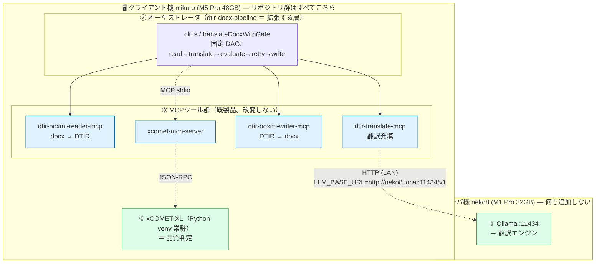
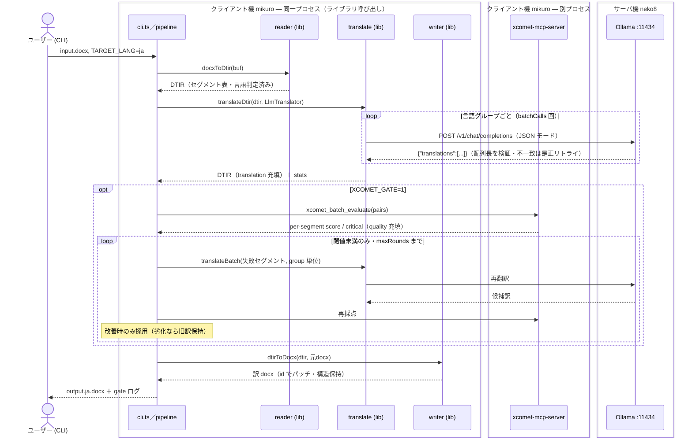
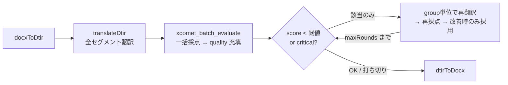

# ローカルLLM 活用手順書 — 混在言語 docx 翻訳パイプライン (dtir MCP 群)

> **この章でできるようになること**: neko8 の Ollama を翻訳エンジンとして、自作 dtir MCP 群で混在言語 docx を**クラウドに出さず**ヘッドレス翻訳し、xCOMET 品質ゲート・モデル比較まで回せるようになる。
>
> **位置づけ**: `llm-server-setup.md` で構築した neko8 を「使う」側の手順書。サーバ構築ではなく、**ローカルLLMを部品（翻訳エンジン）として自作 MCP 群に組み込む**実例。
>
> **前提**:
>
> - `llm-server-setup.md` 完了（neko8 で Ollama が LAN から到達可能）
> - クライアント機（mikuro 等）に Node.js 20+ / npm / git
> - （フェーズ2のみ）Python 3.9〜3.12 venv ＋ HuggingFace アカウント（XCOMET-XL はゲート付き）

## 全体像 — 3つの層を最初に固定する



> ヘッドレス CLI では reader / translate / writer を **MCP サーバとしてではなくライブラリ API として同一プロセス内で**呼ぶ（[`cloud-llm-usage.md`](./cloud-llm-usage.md) の会話駆動とはここが違う）。プロセス境界を越えるのは **xcomet-mcp-server（stdio）** と **Ollama（LAN 越し HTTP）** の2つだけ。

**最重要の非対称性**（ここを外すと設計を誤る）:

- **Ollama＝翻訳エンジン**。`dtir-translate-mcp` の**内部**が HTTP で呼ぶ。MCP ではない。`LLM_BASE_URL` で差すだけ。
- **xCOMET＝品質判定**。独立した MCP サーバで、**オーケストレータが tool として呼ぶ**。再翻訳ループもオーケストレータ側。
- ローカルLLMには「翻訳」だけさせ、**どのツールをどの順で呼ぶかは決定論コード**で固定する（LLM に順序を推論させない）。

### 役割分担（マシン別）

| マシン               | 役割                       | 必要なもの                           |
| -------------------- | -------------------------- | ------------------------------------ |
| neko8 (M1 Pro 32GB)  | 翻訳エンジン専任           | Ollama ＋ 翻訳モデル（5〜6GB/個）    |
| mikuro (M5 Pro 48GB) | オーケストレータ＋品質判定 | dtir リポ群、xCOMET-XL（RAM 約14GB） |

リポジトリ群は**オーケストレータが動く側にだけ**置けばよい。neko8 には何も追加しない。

### 実行シーケンス



## 1. リポジトリ配置（クライアント機）

polyrepo の `file:` 依存が相対参照なので、**6リポジトリを同一親ディレクトリに sibling 配置**する。

```sh
mkdir -p ~/workspace/shuji-bonji/mcps && cd ~/workspace/shuji-bonji/mcps
for r in doc-translation-ir dtir-ooxml-reader-mcp dtir-ooxml-writer-mcp \
         dtir-translate-mcp dtir-docx-pipeline xcomet-mcp-server; do
  git clone https://github.com/shuji-bonji/$r.git
done

# 依存順に install（prepare スクリプトで dist/ が自動ビルドされる）
( cd doc-translation-ir    && npm install )
( cd dtir-ooxml-reader-mcp && npm install )
( cd dtir-ooxml-writer-mcp && npm install )
( cd dtir-translate-mcp    && npm install )
( cd dtir-docx-pipeline    && npm install )
( cd xcomet-mcp-server     && npm install )   # フェーズ2 で使用
```

> `dist/` が無いと「Server disconnected」やモジュール解決失敗になる。再ビルドは `npm run build`。

`dtir-docx-pipeline` には以下が実装済み（2026-06-11、他リポは未改変）:

| ファイル                                       | 役割                                                            |
| ---------------------------------------------- | --------------------------------------------------------------- |
| `src/cli.ts`                                   | ヘッドレス翻訳 CLI（フェーズ1/2 共用）                          |
| `src/verify.ts`                                | 受け入れ検証（`validateDtir`・構造比較）                        |
| `src/xcomet-evaluator.ts`                      | `XcometMcpEvaluator`（xcomet-mcp-server の stdio クライアント） |
| `src/pipeline.ts` の `translateDocxWithGate()` | 品質ゲート＋部分再翻訳ループ                                    |
| `test/model-bench.ts`                          | モデル比較ハーネス                                              |

## 2. 翻訳モデルの準備（neko8 側）

非中国系・日本語対応・M1 Pro 32GB で q4 量子化（8〜9B で 5〜6GB）を基準に選ぶ。

```sh
# まずこれ（Ollama 公式・軽い・指示追従良）
ollama pull aya-expanse:8b
```

### Tower+ 9B（翻訳専用・本命）

Ollama 公式ライブラリに無いが、**HF の GGUF を直接 pull できる**ので Modelfile 手書きは不要。

```sh
ollama pull hf.co/mradermacher/Tower-Plus-9B-GGUF:Q4_K_M   # 5.8GB
ollama cp hf.co/mradermacher/Tower-Plus-9B-GGUF:Q4_K_M tower-plus:9b   # 別名付与

# 動作確認（OpenAI 互換エンドポイント）
curl http://localhost:11434/v1/chat/completions -d '{
  "model": "tower-plus:9b",
  "messages": [{"role":"user","content":"Translate to Japanese: The quarterly report is attached."}]
}'
# → "四半期報告書が添付されています。"
```

| モデル           | 出自          | 特徴                        | 注意                          |
| ---------------- | ------------- | --------------------------- | ----------------------------- |
| `aya-expanse:8b` | Cohere（加）  | 多言語強・公式・軽い        | —                             |
| `tower-plus:9b`  | Unbabel（EU） | **翻訳専用**。xCOMET と同社 | **CC-BY-NC-SA-4.0（非商用）** |
| `gemma4:latest`  | Google（米）  | 汎用。JSON が堅い           | フォールバック用              |

> 量子化はチャットテンプレートごと GGUF に埋め込まれているため pull だけで動く。訳質重視なら `Q5_K_M`/`Q6_K` も選択肢。Ollama の `format: json` は llama.cpp の grammar 強制なのでモデル非依存で効く。

## 3. フェーズ1 — ヘッドレス翻訳 CLI

```sh
cd ~/workspace/shuji-bonji/mcps/dtir-docx-pipeline

# 引数省略 → doc-translation-ir 同梱フィクスチャ（蘭仏独混在の意地悪 docx）で動作確認
LLM_MODEL=tower-plus:9b LLM_BASE_URL=http://neko8.local:11434/v1 \
  npx tsx src/cli.ts

# 任意の docx を日本語へ
LLM_MODEL=tower-plus:9b LLM_BASE_URL=http://neko8.local:11434/v1 TARGET_LANG=ja \
  npx tsx src/cli.ts ./input.docx ./output.ja.docx
```

実測ログ（M5 → neko8 / tower-plus:9b）:

```
model=tower-plus:9b baseUrl=http://neko8.local:11434/v1 targetLang=ja
in=./demo/mixed-with-ja.en-GB.docx
out=./demo/output.ja.docx translated=7 batchCalls=4 langs=nl-NL,fr-FR,en-GB,en-US time=8.7s
```

`batchCalls=4` は**段落数ではなく言語グループ数**。source 言語単位でバッチ翻訳するため、リクエスト数が爆発しない。

### env 一覧（フェーズ1）

| env             | 既定                        | 意味                              |
| --------------- | --------------------------- | --------------------------------- |
| `LLM_MODEL`     | `aya-expanse:8b`            | Ollama モデル名                   |
| `LLM_BASE_URL`  | `http://localhost:11434/v1` | OpenAI 互換エンドポイント         |
| `TARGET_LANG`   | `en-GB`                     | 翻訳先（BCP47）                   |
| `LLM_JSON_MODE` | `true`                      | JSON モード非対応モデルは `false` |

### 受け入れ検証

```sh
# 1. 構造保持の機械検証（訳 docx → 再 reader → validateDtir が空、元 docx と id 集合一致）
npx tsx src/verify.ts ./demo/output.ja.docx ./demo/mixed-with-ja.en-GB.docx

# 2. Word 互換確認（LibreOffice）
brew install --cask libreoffice
soffice --headless --convert-to pdf --outdir ./demo ./demo/output.ja.docx
```

> `Task policy set failed` という警告は macOS 上の LibreOffice の無害な QoS 警告。無視してよい。`--outdir` を省くとカレントに PDF が出る。

### DeepL エンジンで使う（a-3 / クラウド翻訳）

同じ `cli.ts` で、`DEEPL_API_KEY` を渡すと**翻訳エンジンが DeepL に切り替わる**（ローカルLLMの代わり）。
ヘッドレス・固定 DAG・xCOMET ゲートはそのままで、**エンジンだけ差し替わる**（`Translator` 抽象のご利益）。

```sh
# Free/Pro はキー末尾 ":fx" で自動判定（Pro キーでも DEEPL_API_URL は不要）
DEEPL_API_KEY=<your-deepl-key> TARGET_LANG=ja \
  npx tsx src/cli.ts demo/mixed-with-ja.en-GB.docx demo/deepl-out-ja.docx

# 品質ゲートも併用可（DeepL 訳を xCOMET で採点）
DEEPL_API_KEY=<key> XCOMET_GATE=1 XCOMET_PYTHON_PATH=~/.xcomet-venv/bin/python3 \
  npx tsx src/cli.ts in.docx out.docx
```

| env | 意味 |
| --- | --- |
| `ENGINE` | `deepl` \| `llm`（省略時: `DEEPL_API_KEY` があれば deepl、無ければ llm） |
| `DEEPL_API_KEY` | DeepL キー。Free(`...:fx`)/Pro を自動判定してエンドポイントを選ぶ |
| `DEEPL_API_URL` | 任意。明示指定が優先（通常は不要） |

> 注意: ローカルLLMを使いたいのに `DEEPL_API_KEY` が環境に残っていると `engine=deepl` になる。その場合は `ENGINE=llm` を明示する。
> `model-bench` でも `MODELS="deepl,aya-expanse:8b,tower-plus:9b"` のように **DeepL を基準線**として混在採点できる（ローカルが DeepL にどこまで肉薄するか）。

## 4. フェーズ2 — xCOMET 品質ゲート＋再翻訳ループ

### 4.1 xCOMET セットアップ（クライアント機・初回のみ）

```sh
# venv（Python 3.13+ は不可）
uv venv ~/.xcomet-venv --python 3.12
source ~/.xcomet-venv/bin/activate
uv pip install "unbabel-comet>=2.2.0"

# XCOMET-XL はゲート付き → HF でライセンス承認後
huggingface-cli login
python -c "from comet import download_model; download_model('Unbabel/XCOMET-XL')"   # 約14GB
```

### 4.2 実行

```sh
XCOMET_GATE=1 XCOMET_PYTHON_PATH=~/.xcomet-venv/bin/python3 \
LLM_MODEL=tower-plus:9b LLM_BASE_URL=http://neko8.local:11434/v1 TARGET_LANG=ja \
  npx tsx src/cli.ts ./input.docx ./output.ja.docx
```

実測ログ:

```
[gate] round=0 evaluated=7 avg=0.9875 failing=0 critical=0 adopted=0
out=./demo/output.gated.ja.docx translated=7 batchCalls=4 time=48.1s
gate: rounds=1 avg=0.9875 remainingFailing=0
```

### 4.3 仕組み（固定 DAG）



設計ポイント:

- 採点は単発 `xcomet_evaluate` の逐次ではなく **`xcomet_batch_evaluate` で一括**（モデル常駐。CPU 推論は1ペア数秒のため逐次は非現実的）
- 再翻訳は**改善時のみ採用**（再訳がスコア劣化したら旧訳を保持）
- 打ち切り後も低品質のまま残った id は `remainingFailing` としてログに残る

ループの動作確認は閾値を人為的に上げると強制発火できる:

```
XCOMET_THRESHOLD=0.995 で実行した例:
[gate] round=0 evaluated=7 avg=0.9875 failing=2 critical=0 adopted=0
[gate] round=1 avg=0.9875 failing=2 critical=0 adopted=1   ← 改善1件採用
[gate] round=2 avg=0.9875 failing=2 critical=0 adopted=0
[gate] 打ち切り: 2 セグメントが閾値 0.995 未満のまま
gate: rounds=3 remainingFailing=2 [seg_58a194220a,seg_65a3d4bd42]
```

### env 一覧（フェーズ2 追加分）

| env                   | 既定         | 意味                            |
| --------------------- | ------------ | ------------------------------- |
| `XCOMET_GATE`         | —            | `1` でゲート有効化              |
| `XCOMET_PYTHON_PATH`  | 自動検出     | venv の python                  |
| `XCOMET_SERVER_ENTRY` | sibling 解決 | xcomet-mcp-server/dist/index.js |
| `XCOMET_THRESHOLD`    | `0.6`        | 再翻訳閾値                      |
| `XCOMET_MAX_ROUNDS`   | `2`          | 再翻訳ラウンド上限              |
| `XCOMET_USE_GPU`      | `false`      | `true` で GPU(MPS) 推論         |

> 初回は XCOMET-XL のロードで数分＋RAM 約14GB。起動直後の `Health check failed (1/3): Request timeout` はロード待ちでリトライ内に回復するため無害。

## 5. フェーズ3 — モデル比較ハーネス

同一 docx を複数モデルで翻訳 → xCOMET で採点 → Markdown 表で比較。xCOMET は1プロセスを使い回す（ロード1回）。

```sh
MODELS="aya-expanse:8b,tower-plus:9b,gemma4:latest" \
LLM_BASE_URL=http://neko8.local:11434/v1 TARGET_LANG=ja \
XCOMET_PYTHON_PATH=~/.xcomet-venv/bin/python3 \
  npx tsx test/model-bench.ts ./input.docx > bench-result.md
```

実測結果（mixed-with-ja.en-GB.docx → ja、7セグメント）:

| モデル         | 平均スコア | 最小スコア | critical | セグメント数 | 所要時間 |
| -------------- | ---------: | ---------: | -------: | -----------: | -------: |
| tower-plus:9b  |     98.75% |     92.13% |        0 |            7 |    14.4s |
| gemma4:latest  |     98.62% |     92.13% |        0 |            7 |    16.7s |
| aya-expanse:8b |     98.37% |     92.13% |        0 |            7 |    49.0s |

読み方の注意:

- 翻訳専用の Tower+ が首位だが僅差。**7セグメント単一文書なので統計的有意性はない**（傾向把握用）
- 最初のモデルの所要時間には Ollama 側のモデルロードが含まれる。純粋な速度比較は2周目で
- モデル切り替えごとに neko8 でロード（数十秒）が入る
- **Tower+ と xCOMET は同じ Unbabel 製**。評価軸が揃って有利に出やすい構造的バイアスがある

## 6. トラブルシュート

| 症状                                     | 原因 / 対処                                                                                          |
| ---------------------------------------- | ---------------------------------------------------------------------------------------------------- |
| `Cannot find module '.../src/cli.ts'`    | リポジトリの取得漏れ・古い clone。`git pull`                                                         |
| MCP「Server disconnected」               | `dist/` 未生成。`npm install`（prepare）でビルド                                                     |
| `Cannot find package '@shuji-bonji/...'` | sibling 配置していない / 依存を install していない                                                   |
| `model 'xxx' not found`                  | neko8 側で `ollama pull` / `ollama cp`（別名）漏れ                                                   |
| 翻訳の件数が崩れる / JSON でない         | モデルが弱い。`LlmTranslator` の是正リトライが吸収。改善せねば `LLM_JSON_MODE=false` かモデル変更    |
| `zsh: command not found: soffice`        | `brew install --cask libreoffice`（soffice も PATH に入る）                                          |
| LibreOffice の `Task policy set failed`  | macOS 固有の無害な警告。無視                                                                         |
| xcomet `Health check failed (1/3)`       | XL ロード待ち。リトライ内に回復すれば無害                                                            |
| xcomet が重い / 動かない                 | M シリーズは XL 推奨（XXL は 32GB では不可、48GB でも非推奨）。Python 3.12 venv・HF ゲート承認を確認 |

## 7. この章で作ったもの / リセット手順

### neko8 側

```sh
ollama rm tower-plus:9b hf.co/mradermacher/Tower-Plus-9B-GGUF:Q4_K_M aya-expanse:8b
```

### クライアント機側

| 対象              | 削除                                                                         |
| ----------------- | ---------------------------------------------------------------------------- |
| リポジトリ群      | `rm -rf ~/workspace/shuji-bonji/mcps`（git 管理なので clone し直せば復元可） |
| xCOMET venv       | `rm -rf ~/.xcomet-venv`                                                      |
| xCOMET モデル重み | `rm -rf ~/.cache/huggingface`（他プロジェクトと共用の場合は注意）            |
| LibreOffice       | `brew uninstall --cask libreoffice`                                          |

## L3/L4 へのリンク機会（章末コメント）

- **決定論オーケストレーション**（LLM に翻訳だけさせ、ツールの呼び順は固定 DAG）→ L3 の「Agent に推論させる範囲の設計判断」
- **`LLM_BASE_URL` 差し替えだけでエンジン交換**できる Translator 抽象 → L3 の「LLM Gateway / ベンダー非依存」設計
- **評価者と被評価者の同族性**（Tower+ と xCOMET が同じ Unbabel）→ L4 の評価バイアスの構造問題
- **JSON モード（grammar 強制）と是正リトライ**による弱いローカルモデル対策 → L4 の構造化出力の信頼性

## 実装記録・設計判断（2026-06-11 全 Phase 完了）

> 旧 `local-llm-implementation-guide.ja.md`（実装指示書）の §10 を移植。指示書は役目を終えたため統合。

実機（クライアント: mikuro M5 Pro 48GB / 翻訳エンジン: neko8 M1 Pro 32GB の Ollama）で Phase 1〜3 を実装・検証済み。

### 実装物（すべて `dtir-docx-pipeline` 内。他5リポは未改変）

| ファイル | 内容 | 指示書との差分 |
|---|---|---|
| `src/cli.ts` | ヘッドレス翻訳 CLI（Phase 1/2 共用・DeepL/ローカル両対応） | 引数省略時に同梱フィクスチャを使用、`XCOMET_GATE=1` でゲート、`DEEPL_API_KEY` で a-3 |
| `src/verify.ts` | 受け入れ検証 CLI | 指示書外の追加。`validateDtir` 空＋元 docx とのセグメント id 集合比較 |
| `src/xcomet-evaluator.ts` | `XcometMcpEvaluator` | `evaluate()`（Evaluator 契約）に加え `evaluateBatch()` を追加 |
| `src/pipeline.ts` | `translateDocxWithGate()` 追記 | orchestrator 側にループ。下記2点を意図的に変更 |
| `test/model-bench.ts` | モデル比較ハーネス | Markdown 表を stdout 出力、失敗モデルは ❌ 行で続行、DeepL を基準線に混在可 |
| `package.json` | `@modelcontextprotocol/sdk` を依存に追加 | xcomet-mcp-server の stdio クライアントに必要 |

**指示書からの意図的な設計変更（2点）**:

1. **採点は `translateDtir` の evaluator 経由ではなく分離バッチ**。単発 `xcomet_evaluate` の逐次は CPU で1ペア数秒 × 全セグメントとなるため、`xcomet_batch_evaluate`（モデル常駐）で一括採点する。
2. **再翻訳は「改善時のみ採用」**。再訳が旧訳よりスコア劣化した場合は旧訳を保持する（指示書 §4 の「改善しなければ最後の訳を採用」より保守的）。

### モデル準備の実績

- `tower-plus:9b`: Ollama 公式に無いため `ollama pull hf.co/mradermacher/Tower-Plus-9B-GGUF:Q4_K_M`（5.8GB）→ `ollama cp` で別名付与。Modelfile 手書き不要（チャットテンプレートは GGUF 同梱）。**CC-BY-NC-SA-4.0（非商用）に注意**。
- xCOMET-XL はクライアント機（M5）側 venv に常駐。neko8 は翻訳エンジン専任。

### 検証結果

**Phase 1**（`mixed-with-ja.en-GB.docx` → ja / tower-plus:9b）: `translated=7 batchCalls=4 langs=nl-NL,fr-FR,en-GB,en-US time=8.7s`。`verify.ts` ✅・LibreOffice PDF 変換 ✅。

**Phase 2**: 通常閾値(0.6)では `avg=0.9875 failing=0`。ループ動作は `XCOMET_THRESHOLD=0.995` で強制発火させ確認 — round 1 で改善1件採用、round 2 改善なし、maxRounds 打ち切り＋残存 id（`remainingFailing`）のログ出力まで確認済み。

**Phase 3**（7セグメント・単一文書のため傾向把握用）:

| モデル | 平均スコア | 最小スコア | critical | 所要時間 |
|---|---:|---:|---:|---:|
| tower-plus:9b | 98.75% | 92.13% | 0 | 14.4s |
| gemma4:latest | 98.62% | 92.13% | 0 | 16.7s |
| aya-expanse:8b | 98.37% | 92.13% | 0 | 49.0s ※初回ロード込み |

留意点: 最小スコア 92.13% が3モデル同値（共通の難所セグメント）。また Tower+ と xCOMET は同じ Unbabel 製のため、評価軸の同族性バイアスがある（公平な比較には COMET 系以外の指標の併用を検討）。

**a-3（CLI × DeepL）**: `:fx` 自動判定で Pro キーが `api.deepl.com` に自動ルーティング。`translated=7 batchCalls=4 time=2.0s` で訳 docx 生成を確認。

## 改訂履歴

- 2026-06-11 初版作成
  - Tower+ 9B の HF GGUF 直接 pull 手順（`ollama pull hf.co/...` → `ollama cp`）
  - フェーズ1〜3 を実機（mikuro M5 Pro 48GB → neko8 M1 Pro 32GB）で検証した実測ログを掲載
  - xCOMET-XL は M5 側 venv 常駐、neko8 は翻訳エンジン専任の役割分担を採用
